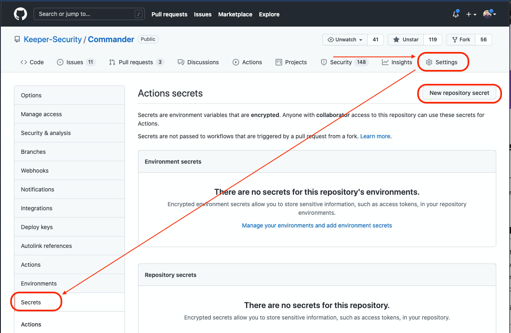
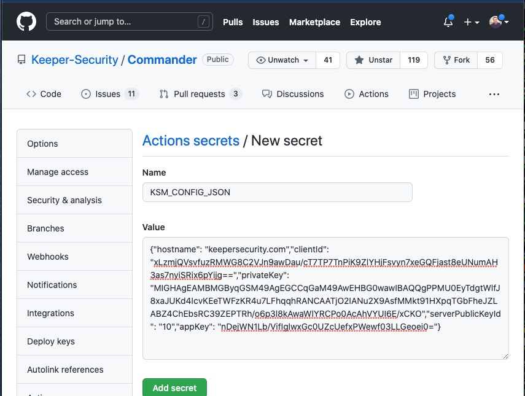
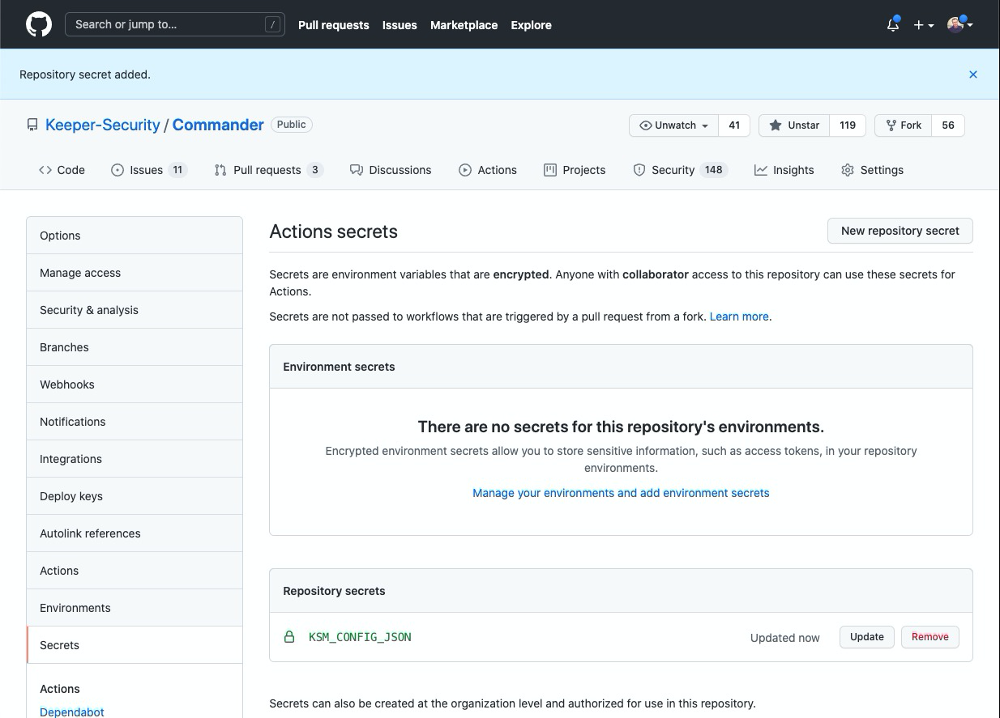

### Step 1: Configure KSM Application & GitHub Secrets

To allow your GitHub Actions workflow to securely access secrets stored in Keeper, you first need to create a KSM Application configuration. This configuration acts as the credential for the GitHub Action.

> **Note:** This step requires you to log in with your own Keeper account credentials. The `install-prereqs.sh` script installs Keeper Commander automatically when this step loads.

**1. Generate KSM Application Configuration using Keeper Commander**

First, launch Keeper Commander and log in with your Keeper account:

`keeper shell`{{execute}}

Once the Commander prompt appears, enter your Keeper email and master password to authenticate.

After logging in, generate a new client configuration for your application. Replace `GitHub-Actions-MyRepo` with a descriptive name for your integration. The `--config-init json` flag outputs the configuration in JSON format, and `--config-init base64` outputs it as a Base64 string (both formats are accepted by the GitHub Action).

`sm client add --app GitHub-Actions-MyRepo --unlock-ip --config-init json`{{copy}}

You should receive output similar to the following. This JSON blob is your KSM Application Configuration — treat it as a sensitive secret.

```
Successfully generated Client Device
====================================
Initialized Config: {"hostname": "keepersecurity.com","clientId":"ab12...","privateKey":"MIG...","appKey":"ZcUe...","appOwnerPublicKey":"BKm9..."}
IP Lock: Disabled
Token Expires On: 2025-10-20 15:07:02
App Access Expires on: Never
```

> **Tip:** You can also use `--config-init base64` to get a single Base64-encoded string, which is convenient for storing in CI/CD systems:

`sm client add --app GitHub-Actions-MyRepo --unlock-ip --config-init base64`{{copy}}

**2. Add the KSM Configuration as a GitHub Secret**

Navigate to your GitHub repository settings, then go to **"Secrets and variables" > "Actions"**. Click **"New repository secret"**.

This KSM configuration will be stored as a GitHub secret, which the Keeper GitHub Action uses to authenticate.



Create a new secret named `KSM_CONFIG` (as used in the examples in the next step). Paste the entire JSON output (or Base64 string) from the previous command as the value.



Once added, your secret will be listed.



In the next step, we will use this GitHub secret (`KSM_CONFIG`) in the Keeper Secrets Manager GitHub Action to retrieve specific secrets from your vault.
